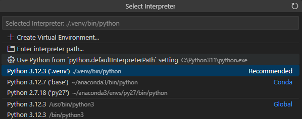

# gRPC API Client Documentation

## Table of Contents
- [Prerequisites](#prerequisites)
- [Project Set Up](#project-set-up)
- [More Info](#more-info)

## Prerequisites
1. Unix-like OS, preferably Ubuntu 24.04 (**WSL works**)
2. [Visual Studio Code](https://code.visualstudio.com/download), with the following plugins:
    - ms-vscode-remote.remote-wsl (**Windows only**)
    - tamasfe.even-better-toml
    - ms-python.vscode-pylance
    - ms-python.python
    - zxh404.vscode-proto3
3. Python 3.12 (comes with Ubuntu 24.04)
4. [Poetry](https://python-poetry.org/docs/#installation)

## Project Set Up
1. Ensure that Poetry will create the client's Python environment within the client's project directory by running:

    ```bash
    poetry config virtualenvs.in-project true
    ```

2.  Create the client's project directory by running:

    ```bash
    poetry new client
    ```

3. `cd` into the newly created project. Then add the Python dependencies for gRPC with:

    ```bash
    poetry add grpcio grpcio-tools
    ```


4. To activate the client's environment, start by running:

    ```bash
    poetry env activate
    ```

    The shell command shown above will have returned another shell command. For example: `source .venv/bin/activate.fish`. Run this returned shell command to finish activating the Python environment

5. To generate the Python gRPC definitions, `cd` to the repo's root. Then run:

    ```bash
    python -m grpc_tools.protoc -I./ --python_out=./api/{module}/{module} --pyi_out=./api/{module}/{module} --grpc_python_out=./api/{module}/{module} ./service.proto
    ```

6. Open the client's project directory in VS Code and begin development of your gRPC API 

**WARNING:** the environment's Python interpreter should be selected as the interpreter to be used by VS Code's Python LSP. Otherwise, features such linting and code completion could have issues working properly. 

To select this interpreter, hit `CTRL + SHIFT + P` and select `Python: Select Interpreter`. Then select *.venv* as shown below:



## More Info
For more info on how to set up a python environment using Poetry, refer to their [basic usage](https://python-poetry.org/docs/basic-usage/) documentation.
