# Team GR IoT Data Pipeline Template Design Diagrams

## Design Diagram D0

| Connection | Protocol | Auth | Properties |
| ---------- | -------- | ---- | ---------- |
| A | SSL   | User/Password | Sensor data gets sent from each facility to the database |
| B | HTTPS | API Token | GroupMe chat bot reports device failures to a maintenance GroupMe |
| C | SSL   | User/Password | Queried sensor data gets streamed to the gRPC API |
| D | HTTPS | mTLS | Rows of queried sensor data get streamed to the API user |


## Design Diagram D1

### Overview

| Connection | Protocol | Auth | Properties |
| ---------- | -------- | ---- | ---------- |
| A | SSL   | User/Password | Sensor data gets sent from each facility to the database |
| B | HTTPS | API Token | GroupMe chat bot reports device failures to a maintenance GroupMe |
| C | SSL   | User/Password | Queried sensor data gets streamed to the gRPC API |
| D | HTTPS | mTLS | Rows of queried sensor data get streamed to the API user |


### Data Schema Tables

```mermaid
erDiagram
Facility {
  SERIAL facility_id PK
  VARCHAR(128) facility_name
}
Sensor {
  SERIAL entry_id PK
  SERIAL facility_id PK,FK
  VARCHAR(64) device "device ID, NOT NULL"
  REAL temp "°C"
  REAl rh "%"
  BIGINT epoch "timestamp, NOT NULL"
}
```




## Design Diagram D2

### Facility Diagram (Input)

| Connection | Protocol | Auth | Properties |
| ---------- | -------- | ---- | ---------- |
| A | MQTTS | User/Password | <ul><li>Devices subscribe to `pulse` and publish to `connect`, `lwt`, and `data/sensor`</li><li>A `connect` message is sent on initial connection to broker. If the device fails, then a `lwt` message is sent to indicate device failure</li><li>When a `pulse` message is received from the broker, sensor data gets encoded as protobuf and sent to the broker's `data/sensor` topic</li></ul> |
| B | MQTTS | User/Password | <ul><li>Clock publishes to `pulse` at a regular interval to start the data collection proccess</li></ul> |
| C | MQTTS | User/Password | <ul><li>Batch-Router is subscribed to `connect`, `lwt`, and `data/sensor`</li></ul> |
| D | TLS | mTLS | <ul><li>Messages from `data.sensor` are batched by storing them in a Redis queue</li><li>When a `connect` message is received, the device ID is stored as a Redis key w/ no expiration</li><li>When a `lwt` message is received, the device ID is stored as a Redis key w/ an expiration duration specified by the message. If another `connect` message is recieved before the key expires, then the expiration gets reset. Otherwise, the device ID is added to a LWT Redis queue and is eventually reported as a device failure</li></ul> |
| E | SSL/HTTPS | User/Password and API Token | <ul><li>Sensor data batches are eventually sent to the Postgresql Database via an SSL connection that uses user/password auth</li><li>LWT batches are eventually sent to a maintenance GroupMe via an HTTPS POST request to a GroupMe chat bot that uses API token auth</li></ul> |


### gRPC API Diagram (Output)

| Connection | Protocol | Auth | Properties |
| ---------- | -------- | ---- | ---------- |
| A | SSL   | User/Password | Queried sensor data gets streamed to the gRPC API |
| B | HTTPS | mTLS | Rows of queried sensor data get streamed to the API user |


```protobuf
service Query {
    rpc GetSensorRows (google.protobuf.Empty) returns (stream SensorRows) {}
}

message SensorRows {
    int32   entry_id = 1;
    int32   facility_id = 2;
    string  device = 3;
    float   temp = 4;
    float   rh = 5;
    int64   epoch = 6;
}
```
