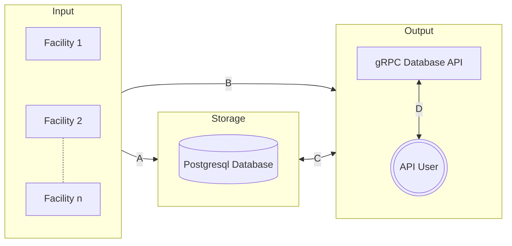
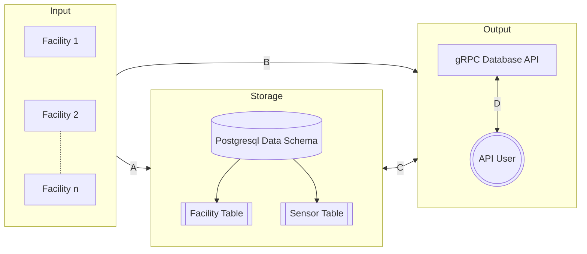
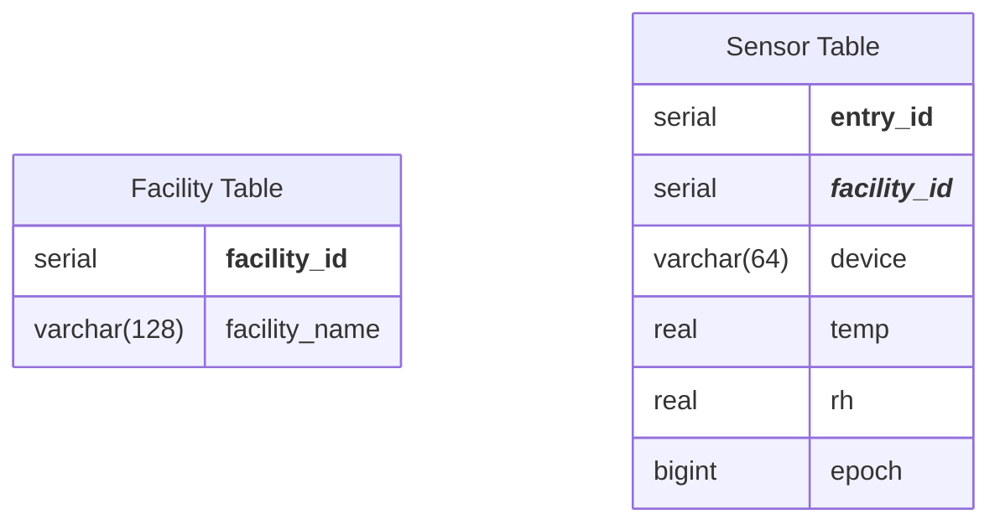
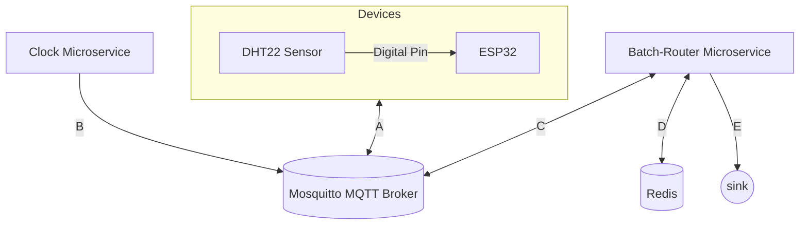

# Team GR IoT Data Pipeline Template

## Design Diagram D0

| Connection | Protocol | Auth | Properties |
| ---------- | -------- | ---- | ---------- |
| A | SSL   | User/Password | Sensor data gets sent from each facility to the database |
| B | HTTPS | API Token | GroupMe chat bot reports device failures to a maintenance GroupMe |
| C | SSL   | User/Password | Queried sensor data gets streamed to the gRPC API |
| D | HTTPS | mTLS | Rows of queried sensor data get streamed to the API user |

## Design Diagram D1

| Connection | Protocol | Auth | Properties |
| ---------- | -------- | ---- | ---------- |
| A | SSL   | User/Password | Sensor data gets sent from each facility to the database |
| B | HTTPS | API Token | GroupMe chat bot reports device failures to a maintenance GroupMe |
| C | SSL   | User/Password | Queried sensor data gets streamed to the gRPC API |
| D | HTTPS | mTLS | Rows of queried sensor data get streamed to the API user |

## Design Diagram D1

### Facility Diagram

| Connection | Protocol | Auth | Properties |
| ---------- | -------- | ---- | ---------- |
| A | MQTTS     | User/Password | Sensor data gets sent from each facility to the database |
| B | MQTTS     | API Token | GroupMe chat bot reports device failures to a maintenance GroupMe |
| C | MQTTS     | User/Password | Queried sensor data gets streamed to the gRPC API |
| D | TLS       | mTLS | Rows of queried sensor data get streamed to the API user |
| E | SSL/HTTPS | mTLS | Rows of queried sensor data get streamed to the API user |

### Facility Diagram