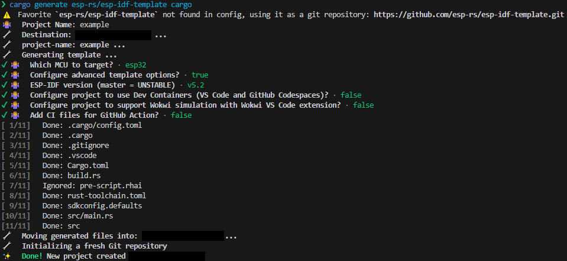
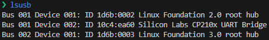

# Firmware Documentation

## Table of Contents
- [Project Description](#project-description)
- [Prerequisites](#prerequisites)
    1. [Hardware Components](#hardware-components)
    2. [Software Requirements](#software-requirements)
- [Hardware Set Up](#hardware-set-up)
- [Project Set Up](#project-set-up)
- [Flashing Firmware](#flashing-firmware)
- [Integration Testing](#integration-testing)
- [Protobuf Message Definitions](#protobuf-message-definitions)
- [Useful References](#useful-references)
- [Credit](#credit)

## Project Description
This firmware project demonstrates how ESP32s can be used by data pipelines to collect temperature and humidity readings from sensors such as the DHT22. This project also illustrates how to develop firmware for the ESP32 using Rust, a relatively new programming language that offers improved memory and thread saftey when compared to other low level languages (e.g. C and C++). Rust also forces explicit error handling via the `Result` and `Option` types. These qualities make it easier to develop more robust firmware

## Prerequisites
### Hardware Components
1. ESP32-WROOM-32 boards
2. DHT22 sensor modules
3. Breadboard and jumper cables
    - **WARNING:** The breadboard must have a minimum of 10 rows 
4. USB to Micro-USB cables

### Software Requirements
1. Unix-like OS, preferably Ubuntu 24.04 (**WSL works**)
2. Protobuf compiler (can be installed via `sudo apt install protobuf-compiler` on Ubuntu)
3. [Visual Studio Code](https://code.visualstudio.com/download), with the following plugins:
    - ms-vscode-remote.remote-wsl (**Windows only**)
    - rust-lang.rust-analyzer
    - tamasfe.even-better-toml
    - zxh404.vscode-proto3
4. [MQTTX CLI](https://mqttx.app/cli)
5. [Rust](https://docs.esp-rs.org/book/installation/rust.html) stable
6. [Cargo Binstall](https://github.com/cargo-bins/cargo-binstall?tab=readme-ov-file#installation)
8. [RISC-V and Xtensa Toolchain](https://docs.esp-rs.org/book/installation/riscv-and-xtensa.html) for Rust
    - **NOTE:** `espup` can be installed using `cargo binstall espup` for quicker installation
9. [Development Requirements](https://docs.esp-rs.org/book/installation/std-requirements.html) for Rust on ESP
10. If you're using WSL, then use [this](https://learn.microsoft.com/en-us/windows/wsl/connect-usb) guide to install `usbipd` for USB passthrough

## Hardware Set Up
1. Connect a red jumper cable from the `3.3V` pin to the DHT22 module's `VCC` pin (+)
2. Connect a black jumper cable from one of the `GND` pins to the DHT22 module's `GND` pin (-)
3. Connect another jumper cable from the `D4` GPIO pin to the DHT22 module's `Data` pin (out)
> **WARNING:** The DHT22 sensor modules have 3 pins and come with an internal 10kΩ pull up resistor. This is in contrast to a bare DHT22 sensor, which requires an external 10kΩ resistor and has 4 pins

## Project Set Up
1. Install [Espflash](https://github.com/esp-rs/espflash/tree/main/espflash):
    ```
    cargo binstall espflash
    ```

2. Install [Cargo-Generate](https://github.com/cargo-generate/cargo-generate?tab=readme-ov-file#installation): 
    ```
    cargo binstall cargo-generate
    ```

3. To start creating a Rust firmware project, run: 
    ```
    cargo generate esp-rs/esp-idf-template cargo
    ``` 

    Then enter the following info when prompted:
    - Project Name
    - Select `esp32` as the MCU to target
    - Select `true` to configure advanced template options
    - Select `v5.2` for the ESP-IDf version
    - Select `false` for the remaining options. This will skip dev container creation, Wokwi VS Code extension download, and CI file creation

    

4. Open the project in VS Code and wait for the *rust-analyzer* plugin to finish initializing 
5. Add any additional project dependencies (including build and dev dependencies) to the project's ***Cargo.toml***
6. If any build dependencies were added, make sure to add their build steps to ***build.rs***
    - An example can be found in this repo's ***Cargo.toml*** and ***build.rs***. Note that the `build_msg` function was added to ***build.rs*** to automate protobuf compilation, which uses the *micropb-gen* crate as a build dependency
7. If the firmware needs access to any sensitive environment variables, make sure to add the *toml-cfg* crate as dependency AND a dev dependency. Doing so allows you to create a hidden ***cfg.toml*** file containing any sensitive environement variables. These variables can the be accessed via a `Config` struct decorated with the `#[toml_cfg::toml_config]` macro
    - For example usage, refer to ***cfg.toml.example*** and ***src/main.rs***
    - Note that the official ***cfg.toml*** is hidden by the repo's ***.gitignore*** file
8. With the project's dependencies and environment variables configured, begin developing your project's firmware until you are ready to flash the board with your firmware
    - **WARNING:** The *rust-analyzer* plugin can sometimes slow down considerably. To remedy this behavior, try refreshing the code editor window by hitting `CTRL + SHIFT + P` and selecting `Developer: Reload Window`

## Flashing Firmware
1. Plug the ESP32 board into your PC using a USB to Micro-USB cable
2. If you are using WSL, follow [these](https://learn.microsoft.com/en-us/windows/wsl/connect-usb#attach-a-usb-device) instructions to enable USB passthrough to WSL for the ESP32
    - **NOTE:** The ESP32 will likely show up as **CP2102 USB to UART Bridge Controller** when listed
3. Double check that the ESP32 is detected by running `lsusb` and searching for **Silicon Labs CP210x UART Bridge**

    

4. Run `cargo build` to compile the firmware. Doing so may reveal compile-time errors that need to be resolved
5. Run `cargo run` to flash your firmware to the board
6. Once the firmware is done flashing, the program will immediately start. The terminal will then serve as a serial monitor which displays the program's output
7. To exit the serial monitor, hit `CTRL + C`. To reopen serial monitor, run `espflash monitor`
8. If the program needs to be permanently stopped, exit the serial monitor and run `espflash erase-flash` to wipe the board's flash memory

## Integration Testing
1. Flash firmware to the board by running `cargo run`
2. When the firmware is almost done flashing, open a 2nd terminal and subscribe to the *connect* MQTT topic. Then wait for a message to appear:
    ```bash
    mqttx sub -t 2a6e2757e512a3b35aee981c1264992f -h test.mosquitto.org -p 8883 -l mqtts --ca src/mosquitto.org.crt -Pp msg.proto -Pmn Connect
    ```
3. Upon receiving a message from the *connect* topic, use `CTRL + C` to disconnect from the broker. Then subscribe to the *data* MQTT topic:
    ```bash
    mqttx sub -t f64893d750df7bacdae2aafa7744e425 -h test.mosquitto.org -p 8883 -l mqtts --ca src/mosquitto.org.crt -Pp msg.proto -Pmn SensorData
    ```
4. In a 3rd terminal, publish a pulse to the *pulse* MQTT topic. Then switch back to the 2nd terminal and wait for a sensor data message: 
    ```bash
    mqttx pub -t 5d4ff171536e1f3c63afcf6709574876 -m "" -h test.mosquitto.org -p 8883 -l mqtts --ca src/mosquitto.org.crt
    ```
5. Once the sensor data has been received, validate the epoch field by converting it to a timestamp. Additionally, the reported temperature should be reasonable. For example, let's say your building's thermostat is set to 65°F (~18°C). The reported temperature should then be near 18°C
    - **NOTE:** https://www.epochconverter.com/ can be used to quickly convert epoch to timestamp
6. To disconnect the board from the MQTT broker, switch to the 1st terminal. Then `CTRL + C` out of the serial monitor and run `espflash erase-flash`

## Protobuf Message Definitions
### Pulse Messages
- **Topic Name:** `pulse`
- **Publisher:** Clock App
- **Subscribers:** Each ESP32 board
- **QoS:** 1 (at least once)
- **Payload:** empty

### Connect Messages
- **Topic Name:** `connect`
- **Publisher:** Each ESP32 board
- **Subscribers:** Batch Router
- **QoS:** 1 (at least once)
- **Payload:**
    ```protobuf
    message Connect {
        string device = 1; // Device name
    }
    ```

### LWT Messages
- **Topic Name:** `lwt`
- **Publisher:** Each ESP32 board
- **Subscribers:** Batch Router
- **QoS:** 1 (at least once)
- **Payload:**
    ```protobuf
    message LWT {
        string device = 1; // Device name
        int64  delay  = 2; // LWT delay interval (seconds)
    }
    ```

### Sensor Data Messages
- **Topic Name:** `data/sensor`
- **Publisher:** Each ESP32 board
- **Subscribers:** Batch Router
- **QoS:** 1 (at least once)
- **Payload:**
    ```protobuf
    message SensorData {
        string device = 1; // Device name
        float  temp   = 2; // Temperature reading (°C)
        float  rh     = 3; // Relative humidity reading (%)
        int64  epoch  = 4; // Unix epoch time (seconds)
    }
    ```

## Useful References
- [The Rust Programming Language Book](https://doc.rust-lang.org/stable/book/title-page.html)
- [The Rustonomicon](https://doc.rust-lang.org/nightly/nomicon/lifetimes.html)
- [Rust by Example](https://doc.rust-lang.org/stable/rust-by-example/index.html)
- [Rust Language Cheat Sheet](https://cheats.rs/)
- [The Rust on ESP Book](https://docs.esp-rs.org/book/introduction.html)
- [DHT22 Datasheet](https://components101.com/sensors/dht22-pinout-specs-datasheet)


## Credit
Special thanks to:
- GitHub user *ivmarkov* for creating the [SNTP](https://github.com/esp-rs/esp-idf-svc/blob/v0.51.0/examples/sntp.rs) and [MQTT](https://github.com/esp-rs/esp-idf-svc/blob/v0.51.0/examples/mqtt_client.rs) `esp-idf-svc` examples. These examples were which were used by this project to set up SNTP and MQTT
- GitHub users *embediver*, *ivmarkov*, and *torkleyy* for their contributions to the [TLS](https://github.com/esp-rs/esp-idf-svc/blob/v0.51.0/examples/tls.rs) `esp-idf-svc` example. This example was used by this project set up wifi and TLS
- GitHub user *YuhanLiin* for their [micropb](https://github.com/YuhanLiin/micropb) crate and its usage examples
- GitHub user *zeldan* for their [DHT sensor driver](https://github.com/rust-dd/embedded-dht-rs/tree/v.0.4.0/examples) example
- GitHub user *Tastaturtaste* for [demonstrating](https://github.com/Tastaturtaste/dht22-driver/blob/main/examples/esp32c3mini1/src/main.rs) how to configure GPIO pins using the `esp-idf-hal` crate
