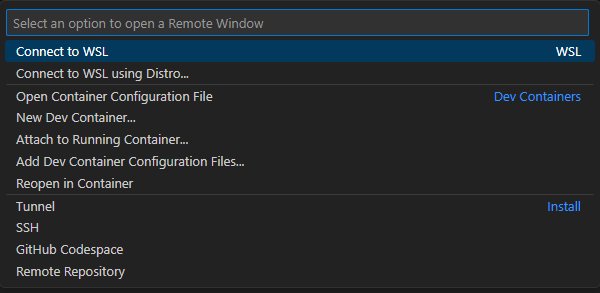

# Table of Contents
1. [Installation](#installation)
    - [Prerequisites](#prerequisites)
    - [From Current Repo](#from-current-repo)
    - [From Scratch](#from-scratch)
2. [Qemu Emulation](#qemu-emulation)
3. [MessagePack Formats](#messagepack-formats)

# Installation
## Prerequisites
Before starting with either form of installation, make sure to install the following software:
- VS Code
- Rancher Desktop

Additionally, make sure the following VS Code extensions are installed:
- Dev Containers 
- Docker

Unfortunately, using xtensa prevents the following MQTT cargo crates from working due to the environment's constraints:
- rumqttc   - only fails with TLS enabled (rustls fails, native requires openssl)
- ntex-mqtt - relies on Linux Signals
- paho-mqtt - the paho mqtt c bindings use an rlib, which ends up being unrecognized here

The same goes for the RISCV boards, except rumqttc fails only because the environment fails to find `riscv32-esp-elf-gcc`. This is peciluar
since the set up for ESP32 RISCV boards required the LLVM toolchain to be installed, not GCC. 

On another note, the esp-idf-svc crate has an MQTT implementation. However, it lacks TLS and MQTT v5 support. In conclusion, Rust still isn't quite ready 
for major IoT development. The dev container approach is also very slow since it constantly rebuilds artifacts for the esp-idf-sys crate. This means that 
Rust firmware will have to use unencrypted MQTT and be developed locally on WSL. The following alternatives have since been considered:
- micropython - python, MQTT v3.1
- atomvm - erlang, MQTT v3.1
- ESP-IDF - C, MQTT v5
- Arduino with wolfSSL and wolfMQTT - C++, MQTT v5 

Note that all alternatives have DHT sensor drivers available, with the ESP-IDF and Arduino options each need their own 3rd party driver

## From Current Repo
To install the Rust dev container from this repo, follow these steps:
1. Open the *firmware* folder in another VS Code window
2. Click the ***Open a Remote Window*** button at the bottom-left corner of VS Code. This will display a pop-up
3. In the pop-up, shown below, select the ***Reopen in Container*** option. The dev container will then mount and initialize   
    
4. Once the dev container is done initializing, wait for the `rust-analyzer` plugin to finish initializing and `ESP-IDF` to finish building before continuing to development work. 
    > This step may take a while. To check progress, click on any VS Code task bar widgets with a loading icon (spinning circle)

## From Scratch
To create your own Rust dev container for ESP32 firmware development, follow these steps:
1. Install Rust on your local machine
2. Run `cargo install cargo-generate` to install the `cargo-generate` util
3. Run `cargo generate esp-rs/esp-idf-template cargo` to begin generating an ESP32 Firmware project in Rust. 
4. For each project generation option, select the following:
    - **Project Name:** Enter your project's name
    - **Which MCU to target** - Select the board your project uses (ESP32)
    - **Configure advanced template options?** - true
    - **Enable STD support** - true
    - **ESP-IDF version** - Select the oldest stable version (v5.1) 
        > The oldest stable version of ESP-IDF should have the least issue being built
    - **Configure project to use Dev Containers?** - true
    - **Configure project to support Wokwi simulation...** - false
        > The license for the Wokwi simulation doesn't remain free forever
    - **Add CI files for GitHub Action?** - Select true or false depending on project needs (false)
5. With the project generated, copy `scripts/qemu_install.sh` and `scripts/qemu_run.sh` into your project's *scripts* folder
    > The current ESP32 Qemu Emulator is intended for xtensa boards being emulated on an x86_64 host machine. If these architectures don't match, go to [Espressif's Releases Page](https://github.com/espressif/qemu/releases) and replace the `wget` URL in `qemu_install.sh` with a URL of the correct release
6. Copy the contents of this repo's `devcontainer.json` into your project's `devcontainer.json`. These are located under the *.devcontainer* folder.
    > The VS Code extensions list originally contained the Wokwi Extension and used a deprecated cargo crate extension. Additionally, a `postCreateCommand` was added to automate the installation of Espressif's ESP32 Qemu Emulator
7. Open the project folder in another VS Code window
8. Follow steps 2 - 4 outlined [here](#from-current-repo)

# QEMU Emulation
To test your firmware via Espressif's ESP32 Qemu Emulator:
1. Create a flash image of the firmware using: `cargo espflash save-image --chip esp32 --merge out.bin --release`
2. Run the image using: `./qemu/bin/qemu-system-<arch> -nographic -machine <board> -drive file=out.bin,if=mtd,format=raw -m 4M`
    - If the board you are using is an xtensa board, relpace `<arch>` with `xtensa`. 
    - Othwerise, replace `<arch>` with `riscv`
    - Make sure to replace `<board>` with your target board name, for example: `esp32`

To see which boards are available, run `./qemu/bin/qemu-system-<arch> -nographic -machine help`

# MessagePack Formats
### Time Pulse Messages
- **Publisher:** Local Server Chron Job
- **Subscribers:** Each ESP32
- **QoS:** 0
- **Special Properties:** none
- **Payload:** empty

### LWT Messages
- **Publishers:** Each ESP32
- **Subscriber:** Local Server LWT Queue
- **QoS:** 1
- **Special properties:** 1 minute delay
- **Payload:**
    | Field Name | Key |Type | 
    | ---------- | --- | --- |
    | Device ID  | dev | 16 bit unsigned integer |

### Data Messages
- **Publishers:** Each ESP32
- **Subscriber:** Local Server Data Queue
- **QoS:** 1
- **Special properties:** none
- **Payload:**
    | Field Name | Key |Type | 
    | ---------- | --- | --- |
    | Device ID | dev | 16 bit unsigned integer |
    | Temperature | temp | 8 bit signed integer |
    | Relative Humidity | rh | 32 bit float |
    | Unix Epoch (s) | epoch | 32 bit unsigned integer |