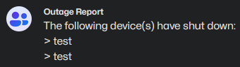

# Microservices Documentation

## Table of Contents
- [Project Description](#project-description)
- [Prerequisites](#prerequisites)
- [Project Set Up](#project-set-up)
- [Integration Testing](#integration-testing)
- [Microservice Dockerfile Configuration](#microservice-dockerfile-configuration)
- [Protobuf Message Definitions](#protobuf-message-definitions)
- [Useful References](#useful-references)
- [Credit](#credit)

## Project Description
This project demonstrates how a data pipeline can be created using microservices written in Go, a programming language that prioritizes simplicity without heavily sacrificing performance. This is due to Go's straightforward syntax, build process, and concurrency management when compared to other systems level languages (e.g. C++). 

Listed below is a brief description of each microservice in this project's repo:
1. [API](api/) - a gRPC API server that can stream all of the rows in the project's Postgres database. Additionally, a gRPC client was written in Python and to view the streamed data. This client is typically used during the integration test 
2. [Batch-Router](batch-router/) - stores batches MQTT messages in Redis and routes each batch to a predefined callback function once the batch has reached max capaxicty or a stale data timeout has been exceeded. In the context of this project of this project, MQTT messages containing sensor data or device failures are batched and routed accordingly. Note that batches of sensor data are uploaded to the project's Postgres database. Batches of device failures, on the other hand, are then reported to a GroupMe chat using the project's chat bot
3. [Client](client/) - an MQTT client that emulates the behavior of an IoT device. Mainly used for integration testing
4. [Clock](clock/) - sends a pulse (i.e. a request for data) to the IoT devices via the project's MQTT broker at a regular interval. As a result, this microservice is essential for timing the collection of data. Halting this microservice during system maintenance will prevent pulses from getting sent to the IoT devices

## Prerequisites
1. Unix-like OS, preferably Ubuntu 24.04 (**WSL works**)
2. [Visual Studio Code](https://code.visualstudio.com/download), with the following plugins:
    - ms-vscode-remote.remote-wsl (**Windows only**)
    - ms-azuretools.vscode-docker
    - tamasfe.even-better-toml
    - golang.go
    - ms-python.vscode-pylance
    - ms-python.python
    - zxh404.vscode-proto3
3. [Rancher Desktop](https://rancherdesktop.io/)
4. [Go 1.24](https://go.dev/dl/)
5. Python 3.12 (comes with Ubuntu 24.04)
6. [Poetry](https://python-poetry.org/docs/#installation)

## Project Set Up
1. Add ***/usr/local/go/bin*** to your environment's path variable:

    ```bash
    export PATH="$PATH:/usr/local/go/bin"
    ```

2. Create a *GOPATH* environment variable that points to the *go* folder in your home directory. Note that this directory should've been added when Go was installed:

    ```bash
    GOPATH=$HOME/go
    ```

3. Add ***$GOPATH/bin*** to your environment's path variable:

    ```bash
    export PATH=$PATH:$GOPATH/bin
    ```

4. Use the following commands to create a Go module (which will contain your microservice's source code):

    ```bash
    mkdir <module-name>
    go mod init <src-control-platform>/<user-name>/<module-name>

    # Example
    mkdir hello-world
    go mod init github.com/your-user-name/hello-world
    ``` 

6. If your microservice plans on using protobuf and gRPC, start by installing the protobuf and gRPC compiler for Go:

    ```bash
    go install google.golang.org/protobuf/cmd/protoc-gen-go@latest
    go install google.golang.org/grpc/cmd/protoc-gen-go-grpc@latest
    ```

    Next, open a terminal in the Go module's parent directory. Then run the following commands. Note that the *service.proto* file containing your RPC and message definitions should also be located in the parent directory:

    ```bash
    protoc --go_out=. --go_opt=Mservice.proto=<module-name>/service --go-grpc_out=. --go-grpc_opt=Mservice.proto=<module-name>/service service.proto
    ```

    Lastly, `cd` into the Go module's root directory and run the following commands to add the necessary dependencies:

    ```bash
    cd <module-name>
    go get google.golang.org/protobuf/proto
    go get google.golang.org/grpc 
    go mod tidy
    ```

7. If your microservice only plans on using protobuf, start by installing the protobuf compiler for Go:

    ```bash
    go install google.golang.org/protobuf/cmd/protoc-gen-go@latest
    ```

    Next, open a terminal in the Go module's parent directory. Then run the following commands. Note that the *msg.proto* file containing your message definitions should also be located in the parent directory:

    ```bash
    protoc --go_out=. --go_opt=Mmsg.proto=<module-name>/msg  msg.proto
    ```

    Lastly, `cd` into the Go module's root directory and run the following commands to add the protobuf dependencies:

    ```bash
    cd <module-name>
    go get -u google.golang.org/protobuf/proto
    go mod tidy
    ```

8. If your microservice plans on using a GroupMe chat bot, then follow [this](https://dev.groupme.com/tutorials/bots) tutorial by GroupMe's developers. This will require creating a GroupMe developer account (for free) and using their form for creating chat bots.  Make sure to keep your chat bot's ID hidden in an environment variable. For an example on how to utilize a GroupMe chat bot from a microservice written in Go, refer to this project's [LWT callback](batch-router/callbacks/callbacks.go) where the outage report is sent via the `http.post` method

9. Now that any preliminary set up has completed (e.g. gRPC/protobuf compilation), you can begin developing your microservice. Note that development in Go is typically an iterative process: 
    - Start by installing some dependecies using `go get`. Then add these dependencies to your source code **before** running `go mod tidy`. Doing so will generate a *go.sum* file, which outlines the full dependency tree of your module. As a result, make sure to run `go mod tidy` before committing changes upstream or building your module. That way, others can install the needed dependencies or build the module
    - **WARNING:** Running `go mod tidy` will also remove any unused dependencies. This includes dependencies that you've added but have not yet used in your source code. Therefore, make sure your project's source code is at a good stopping or saving point before running this command. That way, you won't have to re-add any dependencies that haven't been used just quite yet

10. Once you're ready to build and test your microservice, create a *Dockerfile* to build your microservice and include any necessary files (e.g. TLS certs). This *Dockerfile* can then be used to define the microservice in the project's [docker compose](compose.yaml) file for integration testing. An example of such *Dockerfile* can be found in the section covering [microservice dockerfile configuration](#microservice-dockerfile-configuration)

## Integration Testing
1. Build the services outlined by the project's [docker compose](compose.yaml) using:

    ```bash
    docker-compose build
    ```

    Then, run the services by using:

    ```bash
    docker-compose run
    ```

2. Once the services start running, wait for the GroupMe chat bot to send an outage report. The outage report should list "test" twice:

    

3. To test the gRPC API and ensure that data was properly uploaded to the database, `cd` into the *api/client/* directory. Then run the gRPC client by using the following command:

    ```bash
    poetry run python client/main.py 
    ```

    Note that this command should be valid on all platforms. This is because Poetry names the environment's Python interpreter as *python*. This circumvents the issue with the Python interpreter being named *python* vs *python3* on different platforms 

4. If the gRPC client returned `Tests passed` without throwing any exceptions, then the integration test was a success!

For more info on how to set up a Python environment using Poetry, refer to their [basic usage](https://python-poetry.org/docs/basic-usage/) documentation. To ensure that Poetry creates these environments within the project's directory, run:

```bash
poetry config virtualenvs.in-project true
```

Having these environments stored within the project's directory will make the environment's interpreter be visable to Python's LSP, thus ensure a smoother development process.

## Microservice Dockerfile Configuration
The *Dockerfile* used by each microservice in this example repo follows the same overall structure:

1. Inherit Go's official Alpine Linux image as `build`. This image then gets used to build the microservice. This requires:
    - Copying the source code into the image, along with the *go.mod* and *go.sum* files
    - Running `go mod download` to download all of the dependencies needed for the microservice
    - Running `go mod build` to build the microservice and install its binary in *usr/local/bin/*

2. Inherit the offical Alpine Linux image as `main`, which gets used to run the microservice. This requires:
    - Installing any required system packages (e.g. ca-certificates package, which contains a bundle of commonly used an trusted CA certs) 
    - Copying any files needed by the microservice (e.g. self-signed TLS certs)
    - Running any commands to set up the system and update its CA cert cache
    - Copying the microservice's built binary from the `build` image into the `main` image
    - Defining an entrypoint that will execute your microservice's binary

Below is an example  that demonstrates all of thes practices. It was adapted from this repo's batch-router microservice. Note that using splitting the build process into a `build` and `main` image prevents the `main` docker image from having any unnecessary packages. This allows the `main` docker image to be as small as possible, which makes deploying your microservic easier and potentially less costly.

```Dockerfile
#####################################################
# Inherit from Golang's official Alpine Linux image #
#####################################################
FROM golang:1.24-alpine3.21 AS build

# Source code
COPY callbacks/ /callbacks/
COPY msg/       /msg/
COPY server/    /server/
COPY main.go    /main.go

# Dependencies
COPY go.mod /go.mod
COPY go.sum /go.sum

# Build and install
RUN go mod download
RUN go build -o /usr/local/bin/batch-router /main.go

###################################
# Inherit Alpine Linux 3.21 image #
###################################
FROM alpine:3.21 AS main

# Install common CA certs
RUN apk update && apk add ca-certificates && rm -rf /var/cache/apk/*

# Upload the project's self-signed CA cert
COPY ca.crt /usr/local/share/ca-certificates/ca.crt

# Update the system's CA cert cache
RUN update-ca-certificates

# Upload client certs
COPY certs/ /certs/

# Copy the built binary from the previous stage, then set it as the entry point
COPY --from=build /usr/local/bin/batch-router /usr/local/bin/batch-router
ENTRYPOINT [ "batch-router" ]
```
## Protobuf Message Definitions
### Pulse Messages
- **Topic Name:** `pulse`
- **Publisher:** Clock App
- **Subscribers:** Each ESP32 board
- **QoS:** 1 (at least once)
- **Payload:** empty

### Connect Messages
- **Topic Name:** `connect`
- **Publisher:** Each ESP32 board
- **Subscribers:** Batch-Router
- **QoS:** 1 (at least once)
- **Payload:**
    ```protobuf
    message Connect {
        string device = 1; // Device name
    }
    ```

### LWT Messages
- **Topic Name:** `lwt`
- **Publisher:** Each ESP32 board
- **Subscribers:** Batch-Router
- **QoS:** 1 (at least once)
- **Payload:**
    ```protobuf
    message LWT {
        string device = 1; // Device name
        int64  delay  = 2; // LWT delay interval (seconds)
    }
    ```

### Sensor Data Messages
- **Topic Name:** `data/sensor`
- **Publisher:** Each ESP32 board
- **Subscribers:** Batch-Router
- **QoS:** 1 (at least once)
- **Payload:**
    ```protobuf
    message SensorData {
        string device = 1; // Device name
        float  temp   = 2; // Temperature reading (°C)
        float  rh     = 3; // Relative humidity reading (%)
        int64  epoch  = 4; // Unix epoch time (seconds)
    }
    ```


## Useful References
- [Go by Example](https://gobyexample.com/)
- [Go Redis Guide](https://redis.uptrace.dev/guide/)
- [GORM Docs](https://gorm.io/docs/)
- [Protobuf Overview](https://protobuf.dev/overview/) 
- [Protobuf Language Guide](https://protobuf.dev/programming-guides/proto3/)
- [Protobuf Go Tutorial](https://protobuf.dev/getting-started/gotutorial/)
- [gRPC Docs](https://grpc.io/docs/)

## Credit
Special thanks to:
- GitHub users *vishnureddy17*, *alsm*, *MattBrittan*, and *fracasula* for their contributions to the AutoPaho [Basics](https://github.com/eclipse-paho/paho.golang/blob/v0.22.0/autopaho/examples/basics/basics.go) example, which was used by this project to implement an MQTT client in Go
